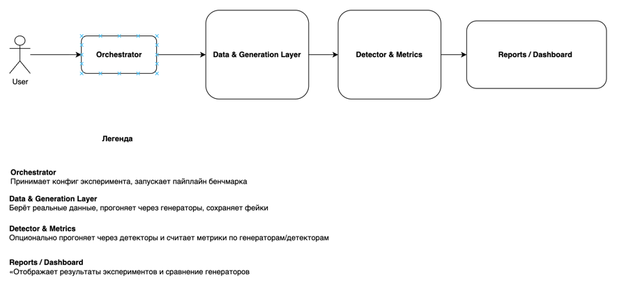
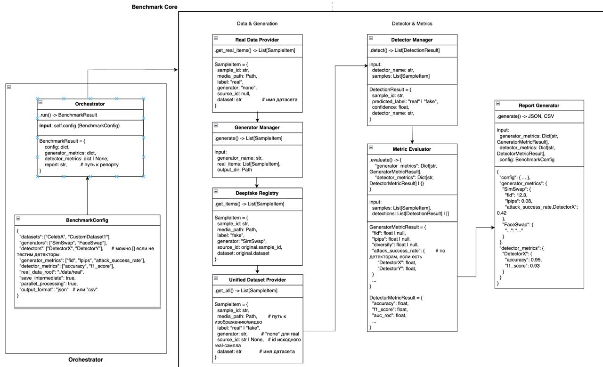

## Дизайн ML системы - <Бенчмарк DeepFake методов для борьбы с мошенниками> <MVP> <1.0>

DeepFake benchmarking service – библиотека для оценки и сравнения методов детекции дипфейков в сценариях удалённой верификации личности и антифрода. 
Сервис использует модели компьютерного зрения и глубокого обучения для анализа видео и изображений, расчёта метрик качества и устойчивости к различным типам атак. 
А также поддерживает единый пайплайн подготовки данных, запуска экспериментов и генерации отчётов по моделям. 
Проект ориентирован на снижение рисков мошенничества и выбор оптимальных моделей для продакшена.

### 1. Цели и предпосылки 
#### 1.1. Зачем идем в разработку продукта?  

Основная цель продукта — снизить убытки от мошенничества и нагрузку на ручные проверки в сценариях удалённой верификации личности.

Сейчас есть кастомные детекторы, но они показывают не лучшее качество. 
Так как современные deepfake-атаки очень качественные и способов создавать дипфейки множество, иногда бывает очень сложно отличить дипфейк от оригинала
Поэтому хотелось бы иметь единый набор данных и метрик, по которым сравниваются все модели (open-source и кастомные), а также возможность регулярно переобучать и переоценивать решения по мере появления новых атак и данных.
В итоге бизнес получает не просто один детектор для специального сценария, а управляемую систему с множеством детекторов, понятной эффективностью и точками улучшения.

Для первой итерации (MVP бенчмарка) критерии успеха можно сформулировать так:

1. Функциональный успех:
    * Есть рабочий пайплайн, который:
        * Берёт стандартный тестовый набор видео или фото (оригиналы + дипфейки),
        * Прогоняет через минимум 2–3 разных детектора, 
        * Строит отчёт с ключевыми метриками (TPR/FPR или latency).

2. Бизнес-результат (первый измеримый эффект):
    * На тестовых данных мы показываем, что выбранный по бенчмарку детектор:
        * Ловит не меньше X% дипфейков при фиксированном уровне ложных срабатываний (например, FPR ≤ 1% на живых пользователях);
        * Даёт потенциал снизить долю ручных проверок на Y% в пилотном процессе.

3. Процессный успех:
    * ML-команда договорились о:
        * Формате датасета и разметки
        * Методах которые используем для генерации
        * периодичности запусков бенчмарка (например, раз в квартал),
        * наборе бизнес-метрик, которые будем отслеживать дальше: fraud-loss, доля ручных проверок, конверсия онбординга, количество инцидентов.

#### 1.2. Бизнес-требования и ограничения  

**Бизнес хочет от продукта:**

* Единый бенчмарк по дипфейкам для сценария видео-KYC и удалённой верификации личности.
* Сравнение моделей (open-source, кастомные) по качеству детекции и скорости.

**Бизнес-ограничения:**

* Latency и UX: проверка на дипфейк не должна заметно увеличивать время онбординга (ориентир — не более N секунд к текущему процессу).
* Ложные срабатывания: очень жёсткий лимит на FPR — блокировка честного клиента дороже, чем пропуск единичного дипфейка.

**Для MVP бенчмарка бизнес ожидает:**

* Собран пул лучших датасетов (оригинальные видео/фото + дипфейки).
* Реализован офлайн-бенчмарк, который сравнивает минимум 2–3 кандидата (наши модели + сторонние).
* Подготовлен отчёт с рекомендацией, какую модель или комбинацию моделей выносить в пилот.

**Весь бизнес-процесс:**

* Пользователь проходит стандартную паспорт-верификацию.
* Фото параллельно отправляется в модуль детекции дипфейков.
* Модуль возвращает скор/класс: “живой / подозрение на дипфейк”.

**В пилоте:**

* Либо работаем в shadow-режиме (модель не блокирует, а только логирует решения для анализа),
* Либо для высоких скорингов дипфейка заявка автоматически уходит на ручную проверку.

**Критерии успешного пилота:**

* Обнаруживает не менее N % известных дипфейк-кейсов;
* Не превышает целевой порог по FPR на недипфейках пользователях;
* Не увеличивает среднее время онбординга более чем на N секунд.

**Дальнейшее развитие:**

* Расширение бенчмарка на новые типы атак: GANs и диффузионки.

#### 1.3. Что входит в скоуп проекта/итерации, что не входит   

**В скоуп MVP считаем:**

* Определить набор сценариев атак и метрик для бенчмарка (TPR/FPR, ROC-AUC, EER, latency) и зафиксировать их с бизнесом.
* Собрать и подготовить датасеты для оценки.
* Реализовать офлайн-пайплайн бенчмарка:
  * Загрузка данных и препроцессинг;
  * Единый запуск генерации;
  * Расчёт метрик и генерация отчёта.

**Что не входит в скоуп итерации:**

* Полная продакшн-интеграция в KYC-процесс (микросервисы, очереди, мониторинг в проде).
* Оптимизация под real-time / streaming и массовую нагрузку.
* Разработка с нуля SOTA-модели детекции дипфейков – на этом шаге мы используем готовые/базовые решения, цель итерации именно бенчмарк.
* Масштабная разметка данных и построение сложной MLOps-инфраструктуры (Feature Store, MLFlow и т.п.).

**Результат по качеству кода и воспроизводимости:**
* В результате получается структурированный репозиторий с понятными директориями (data/, benchmark/, models/, configs/, notebooks/)

**Планируемый технический долг:**

* Оптимизация производительности (GPU-батчинг, multi-GPU, асинхронные очереди) запланирована на этап перед полноценным продом.

#### 1.4. Предпосылки решения  

Исходим из того, что модель работает на опенсорсных данных. 
Единица решения — одна верификационная-сессия: на вход видео или фото с лицом, на выход один скор “real / deepfake”, который дальше использует бизнес-логика (пропуск, ручная проверка, блокировка). 
Модель должна работать онлайн в момент онбординга с ограничением по времени ответа и приоритетом на минимизацию ложных срабатываний на честных пользователей.

### 2. Методология `Data Scientist`     

#### 2.1. Постановка задачи  

С точки зрения постановки задачи мы решаем задачу бинарной классификации видео на “real / deepfake” в онлайн-сценарии KYC, плюс строим вокруг неё офлайн-бенчмарк-платформу.

Формально:
На вход модель получает видео из KYC-сессии, на выходе даёт скор принадлежности к классу “deepfake”. Дальше этот скор используется в бизнес-логике (пропуск, отправка на ручную проверку, блокировка).

В рамках итерации я, как Data Scientist, формулирую и решаю две связанные технические задачи:
* Интегрировать детекторы дипфейков
* Построить воспроизводимый бенчмарк, который по единому датасету и метрикам сравнивает разные модели.

#### 2.2. Блок-схема решения  



#### 2.3. Этапы решения задачи `Data Scientist`  

**Этап 1 — Подготовка данных и витрин**

Данные и сущности

Ключевая сущность: SampleItem
(то, что потом попадает в Unified Dataset)

````
sample_id      — уникальный ID
media_path     — путь к изображению/видео
label          — "real" / "fake"
generator      — имя генератора ("none" для real)
source_id      — ID исходного real-сэмпла (для fake)
dataset        — имя датасета
meta           — разрешение, тип устройства, дата, страна и т.п.
````

**Таблица данных (пример)**:

#### Целевая переменная

| Название             | Описание                                           | Тип           | Гранулярность             | Источник                    |
|----------------------|----------------------------------------------------|--------------|---------------------------|-----------------------------|
| sample_id            | Уникальный идентификатор видео/сессии             | string/int   | KYC-сессия / видео / фото | Формируется при сборе датасета |
| y_is_deepfake        | Флаг, является ли видео дипфейком (0 — real, 1 — fake) | int {0,1}    | KYC-сессия / видео / фото       | Метаданные публичных датасетов + ручная разметка |
| y_attack_type        | Тип атаки: real / deepfake / replay / face_swap…  | category     | KYC-сессия / видео / фото        | Метаданные датасета / разметка |

#### Признаки (features)

| Название              | Описание                                        | Тип              | Гранулярность           | Источник                         |
|-----------------------|-----------------------------------------------|------------------|-------------------------|----------------------------------|
| sample_id             | Уникальный идентификатор, ключ для join c target | string/int       | KYC-сессия / видео / фото      | То же, что в target              |
| video_path            | Путь до исходного видеофайла                   | string           | KYC-сессия / видео / фото      | Локальный датасет / файловая система |
| frames_dir            | Путь до директории с извлечёнными кадрами      | string           | KYC-сессия / видео / фото      | Сгенерировано препроцессингом   |
| duration_sec          | Длительность видео                             | float            | KYC-сессия / видео / фото      | Рассчитано при препроцессинге   |
| fps                   | Частота кадров                                 | float            | KYC-сессия / видео / фото      | Рассчитано при препроцессинге   |
| device_type           | Тип устройства (mobile / web / unknown)        | category         | KYC-сессия / видео / фото      | Метаданные датасета             |
| face_embeddings_path  | Путь до файла с эмбеддингами лица по кадрам    | string           | KYC-сессия / видео / фото      | Сгенерировано моделью face-rec  |

**Бейзлайн**

1. Берём один основной датасет real-видео лиц и фильтруем его по:
   * разрешению (≥ 256×256),
   * наличию лица (face detector),

2. Формируем датасет

**MVP**

MVP расширяет бейзлайн:

1. Подключаем несколько real-датасетов:
    * внутренние,
    * публичные (DFDC, FF++, CelebA-HQ и др.).

2. Вводим единую схему метаданных:

    * device_type, country, capture_type, lighting, split (train/val/test).

3. Проверяем качество:

    * наличие артефактов,

    * дубликаты между датасетами.
 
4. Дообучаем имеющиеся детекторы

**Риски и что делаем**

* Риск: мало качественных данных → генераторы и метрики будут не репрезентативны.
* Действия: ресерч всех открытых датасетов, либо собственный сбор качественного датасета

**Этап 2 — Разработка бейзлайна бенчмарка**

Цель: получить самый простой рабочий бенчмарк “один генератор + один датасет” и зафиксировать стартовые метрики.

Формирование выборки

1. Базовый датасет с реальными лицами

   * Берём набор реальных данных
   * Разбиваем на две части:
     * 80% identity — используем сейчас.
     * 20% identity — откладываем как hold-out под будущий MVP.


2. Генерируем фейки:

   * Выбираем 1 генератор (например, SimSwap с готовыми весами).
   * Для каждой пары (source_identity, target_identity) в подвыборке генерим 1 fake.
   * Получаем набор фейков 

3. Объединённый baseline-датасет

   * Склеиваем реальные и фейковые данные.
   * В этом датасете у каждого объекта есть метка real / fake, и его уже можно использовать для обучения/оценки первого детектора.

**Целевая переменная и метрики для baseline**

У нас не классическая модель, но есть целевой показатель-бейзлайн:

* Attack Success Rate (ASR) относительно одного детектора:

   * генерим фейки → прогоняем через детектор;
   * attack_success = 1, если детектор говорит “real”.

**Этап 3 — MVP бенчмарка**

Цель MVP — улучшить бейзлайн, научиться объективно сравнивать генераторы и одновременно понимать, 
как текущие детекторы выдерживают разные типы атак. 
Для каждого генератора 
𝐺 мы определяем “качество генератора” как набор метрик: 
FID/LPIPS по каждому датасету (реалистичность), 
ASR — долю фейков, которые конкретный детектор 
𝑘 на датасете 𝐷 принимает за real (ASR(Gᵢ, Dⱼ, Detector_k)). 
Для детекторов считаем TPR/FPR на объединённом датасете и, 
что важнее для бизнеса, TPR при низком FPR по каждому генератору, 
чтобы видеть, какие атаки проходят лучше всего.

**Этап 4 — Финальный отчёт и интеграция в процесс**

DS готовит финальный отчёт:

   * Cравнение генераторов,
   * Список “дыр” (генератор × датасет × детектор, где ASR слишком высок).

### 3. Подготовка пилота  
  
#### 3.1. Способ оценки пилота  
  
Возьмем real-датасет, сгенерируем на нём дипфейки одним генератором,
посчитаем базовые метрики качества и метрику ASR. Также смотрим, что 
что пайплайн отрабатывает и визуально оцениваем качественный ли фейк или нет.
Если люди не верят фейкам, а детектор верит, значит генератор слабый для нашей задачи;
Если наоборот — генератор потенциально опасный, детектор слабый.
  
#### 3.2. Что считаем успешным пилотом  
  
Пилот считаем успешным, если можно:

* Если пайплайн запускается и на выходе получаются фейки высокого качества,
* На основе сгенерированных фейков, дообучаем текущие детекторы.

#### 3.3. Подготовка пилота  
  
Фиксируем:

* GPU-бюджет пилота (например, не более 200 GPU-часов),
* Максимальный размер хранилища под фейки (например, 1–2 TB),
* Максимальное время прогона (например, 24 часа).
* Если по результатам пробного запуска baseline-конфигурации время или объём памяти превышают ожидания — 
уменьшаем число генераторов или детекторов, 
либо уменьшаем разрешение медиа.

### 4. Внедрение `для production систем, если требуется`    
 
#### 4.1. Архитектура решения   
  
  

У нас есть библиотека/UI, где пользователи задают конфиг эксперимента: какие датасеты, генераторы и, опционально, детекторы мы хотим бенчмаркать.
Конфиг идёт в Orchestrator, который запускает пайплайн:
из Real Data Store выбираются реальные сэмплы, через Generation Engine генерятся фейки и складываются в хранилище.
Далее Unified Dataset Builder собирает real и fake лица в единый датасет.
Этот датасет мы, при необходимости, прогоняем через детекторы и затем в Metrics Engine, который считает метрики для генераторов и для детекторов.
Все метрики и конфиг пишутся в Metrics DB, а Report/Dashboard показывает сравнение генераторов и историю экспериментов.

#### 4.2. Описание инфраструктуры и масштабируемости 
  
Для генераторов дипфейков мы используем имеющийся Kubernetes-кластер с GPU-нодами. 
Генераторы и детекторы упакованы в Docker-образы, 
а сами прогонки бенчмарка запускаются как независимые задачи через Airflow. 
Orchestrator по BenchmarkConfig последовательно поднимает джобы выбора real-данных, 
генерации фейков, прогонов через детекторы и расчёта метрик. 
Все данные лежат в хранилище: real-видео берём из Data Lake, 
фейки складываем в отдельный бакет с тегами experiment_id / generator / dataset. 
Метрики и статусы экспериментов пишутся в отдельную БД (Postgres + OLAP для агрегаций).

#### 4.3. Требования к работе системы  
  
Библиотека должна корректно отрабатывать 100% запусков на поддерживаемых конфигурациях (Python-версия, CUDA, тип GPU), 
не падать с необработанными исключениями.
Запуск бенчмарка с одним и тем же BenchmarkConfig на одинаковых данных должен давать одни и те же метрики с точностью до погрешности (фиксируем random seed, версию генераторов/детекторов, версию самой библиотеки).
Для всех фатальных ошибок (нет GPU, не найден генератор, не хватает памяти) должны быть читаемые логи.

